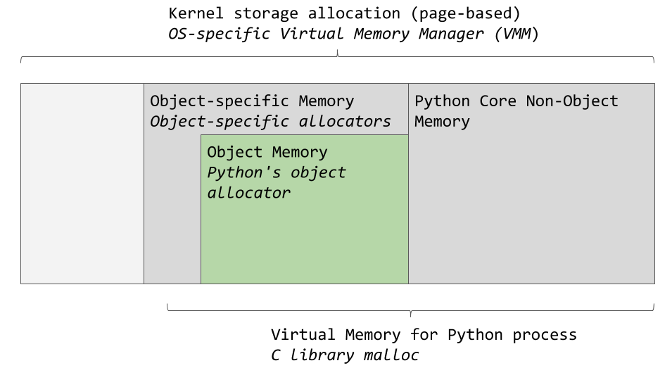
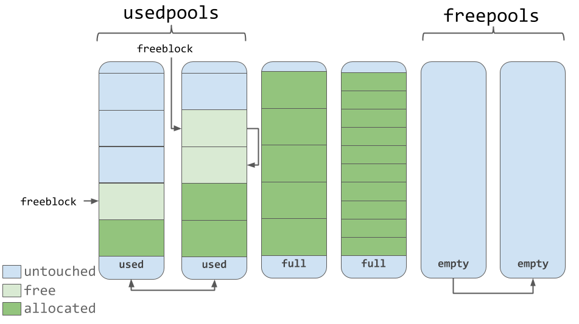
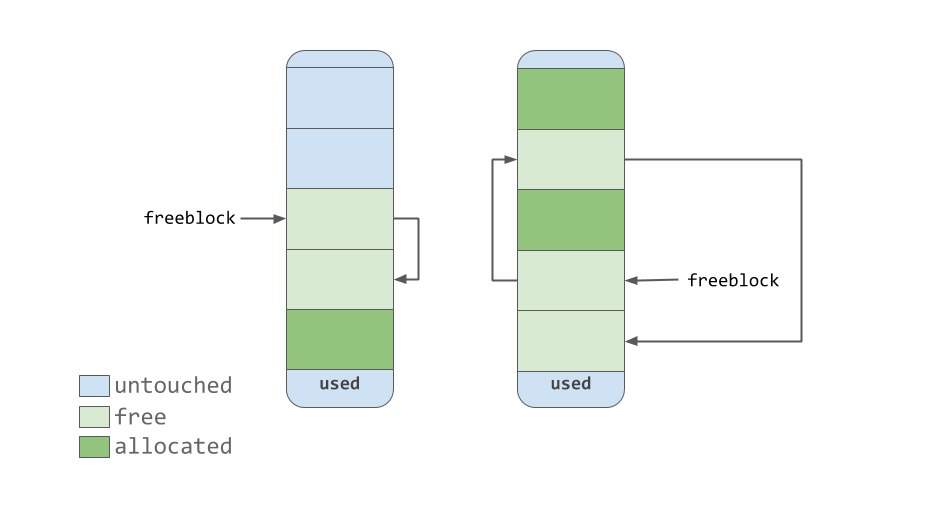
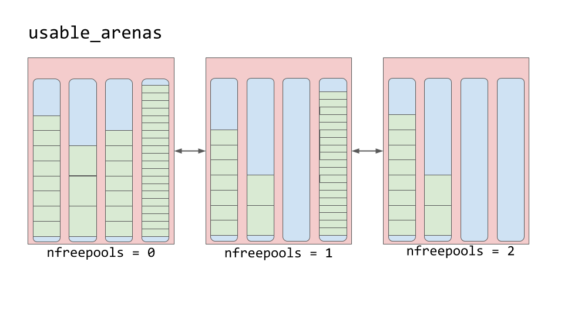

## Управление памятью в CPython

***`Важно`***: реализация в разных версиях Python может отличаться. Но даже со второй версии изменилось не многое (если говорить о концепциях работы с памятью в целом).

Исходный код взят [тут](https://github.com/python/cpython/blob/3.11/Include/object.h)
```c

/* Nothing is actually declared to be a PyObject, but every pointer to
 * a Python object can be cast to a PyObject*.  This is inheritance built
 * by hand.  Similarly every pointer to a variable-size Python object can,
 * in addition, be cast to PyVarObject*.
 */
typedef struct _object {
    _PyObject_HEAD_EXTRA
    Py_ssize_t ob_refcnt;
    PyTypeObject *ob_type;
} PyObject;

typedef struct {
    PyObject ob_base;
    Py_ssize_t ob_size; /* Number of items in variable part */
} PyVarObject;

/* Define pointers to support a doubly-linked list of all live heap objects. */
#define _PyObject_HEAD_EXTRA            \
    PyObject *_ob_next;           \
    PyObject *_ob_prev;

/* PyObject_HEAD defines the initial segment of every PyObject. */
#define PyObject_HEAD                   PyObject ob_base;

/* PyObject_VAR_HEAD defines the initial segment of all variable-size
 * container objects.  These end with a declaration of an array with 1
 * element, but enough space is malloc'ed so that the array actually
 * has room for ob_size elements.  Note that ob_size is an element count,
 * not necessarily a byte count.
 */
#define PyObject_VAR_HEAD      PyVarObject ob_base;


/* PyTypeObject structure is defined in cpython/object.h.
   In Py_LIMITED_API, PyTypeObject is an opaque structure. */
typedef struct _typeobject PyTypeObject;
```
- **PyObject_HEAD** - начальный сегмент каждого объекта
- **_PyObject_HEAD_EXTRA** - указатели для поддержки двусвязного списка всех "живых" объектов в куче
- **PyObject** - предок всех объектов в CPython
    - *ob_refcnt* — счётчик ссылок, используемый для реализации механизма сборки мусора
    - *PyTypeObject \*ob_type* - указатель на тип объекта
- **PyVarObject** - аналог PyObject но для динамически изменяющихся в размере объектов.

**PyTypeObject** - структура, описывающая каждый конкретный тип `Python` (string, dict, int, etc). Её полную реализацию можно найти [тут](https://github.com/python/cpython/blob/3.10/Include/cpython/object.h#L191)

Каждый объект имеет собственный механизм работы с памятью, который знает, как  получить память, необходимую для хранения этого объекта и «освободить» память когда она больше не нужна.

Однако стоит отметить, что компьютерная память является разделяемым ресурсом. Если, в одно и то же время, два разных процесса или потока попытаются записать что-то в одну и ту же область памяти, может произойти что-то нехорошее.

## **GIL** - Глобальная блокировка интерпретатора

Глобальная блокировка интерпретатора (Global Interpreter Lock, GIL) - это единый глобальный механизм интерпретатора, который блокирует разделяемые ресурсы, с которыми работает поток. Это значит, что в один момент времени может работать только один поток. Более подробно, можно найти [тут](./gil.md)

## **GC** - Сборка мусора

Python имеет встроенный механизм сборки мусора, который отслеживает и удаляет неиспользуемые объекты в куче. Таковыми в Python являются объекты, счётчики
ссылок (в структуре *PyObject*) которых равняются нулю.

Более подробно про сборщик мусора СPython [тут](./garbage-collection.md)

## Механизмы управления памятью в CPython

Менеджер виртуальной памяти конкретной операционной системы выделяет
фрагмент памяти для процесса Python. Тёмно-серые области на изображении — это фрагменты памяти, принадлежашие Python.


*Области памяти, используемые CPython*

Python задействует некую область памяти для внутреннего использования и для
нужд, не связанных с выделением памяти для объектов. Ещё один фрагмент памяти используется для хранения объектов. Данная схема является весьма упрощенной. Более подробно всё объяснено в исходном коде. Например тут: [py_arena](https://github.com/python/cpython/blob/3.11/Include/internal/pycore_pyarena.h) и [py_mem](https://github.com/python/cpython/blob/3.11/Include/internal/pycore_pymem.h)

В CPython есть средство выделения памяти под объекты, ответственное за
выделение памяти в области, предназначенной для хранения объектов. Самое интересное происходит именно при работе этого механизма. Он вызывается тогда,
когда объект нуждается в памяти, или в случаях, когда память нужно освободить.

Обычно добавление или удаление данных в объекты Python наподобие **list** и **int** не предусматривает одномоментную обработку очень больших объёмов информации. Поэтому архитектура средства выделения памяти построена с прицелом на обработку маленьких объёмов данных. Кроме того, это средство стремится к тому, чтобы не выделять память до тех пор, пока не станет ясно, что это совершенно необходимо.

[Комментарии в исходном коде](https://github.com/python/cpython/blob/3.11/Objects/obmalloc.c#L800) описывают средство выделения памяти как
«быстрый, специализированный инструмент выделения памяти для небольших
блоков, который предназначен для использования поверх универсального malloc».
В данном случае malloc — это функция библиотеки C, предназначенная для
выделения памяти.

Давайте обсудим стратегию выделения памяти, используемую CPython. Сначала мы
поговорим о трёх сущностях — так называемых блоках (block), пулах (pool) и аренах
(arena), и о том, как они связаны друг с другом.

**Арены** — это самые большие фрагменты памяти. Они выровнены по границам
страниц памяти. Граница страницы — это место, где оканчивается непрерывный
блок памяти фиксированной длины, используемый операционной системой.
Python, в ходе работы с памятью, исходит из предположения о том, что размер
системной страницы памяти равняется 256 Кб.


*Арены, пулы и блоки*

На аренах расположены пулы, представляющие собой виртуальные страницы
памяти размером 4 Кб. Они напоминают страницы книги из нашего примера. Пулы
разделены на небольшие блоки памяти.
Все блоки в одном пуле принадлежат к одному и тому же классу размера (size class).
Класс размера, к которому принадлежит блок, определяет размер этого блока,
который выбирается с учётом запрошенного объёма памяти. Вот таблица, взятая из
исходного кода, в которой продемонстрированы объёмы данных, запросы на сохранение которых в памяти обрабатывает система, размеры выделяемых блоков и
идентификаторы классов размеров.


Объём данных в байтах| Объём выделенного блока | idx класса размера
---|---|---
1-8 | 8 | 0
9-16 | 16 | 1
17-24 | 24 | 2
25-32 | 32 | 3
33-40 | 40 | 4
41-48 | 48 | 5
49-56 | 56 | 6
57-64 | 64 | 7
65-72 | 72 | 8
... | ... | ...
497-504 | 504 | 62
505-512 | 512 | 63

Например, если запрошено сохранение 42 байтов, то данные будут помещены в 48-
байтовый блок.

### Пулы

Пулы состоят из блоков, принадлежащих к одному классу размера. Каждый пул
связан с другими пулами, содержащими блоки одинакового с ним класса размера, с
использованием механизма двусвязного списка. При таком подходе алгоритм
выделения памяти может легко найти свободное место для блока заданного
размера, даже если речь идёт о поиске свободного места в разных пулах.

Список usedpools позволяет отслеживать все пулы, в которых есть место для
данных, принадлежащих к определённому классу размера. Когда запрашивается
сохранение блока некоего размера, алгоритм проверяет этот список на предмет
нахождения списка пулов, хранящих блоки нужного размера.
Сами пулы должны пребывать в одном из трёх состояний. А именно, они могут
использоваться (состояние used ), они могут быть заполненными ( full ) или
пустыми ( empty ). В используемом пуле есть свободные блоки, в которых можно
сохранить данные подходящего размера. Все блоки заполненного пула выделены
под данные. Пустой пул не содержит данных, и он, при необходимости, может быть
назначен для хранения блоков, принадлежащих к любому классу размера.

Список freepools хранит сведения обо всех пулах, находящихся в состоянии
empty . Например, если в списке usedpools нет записей о пулах, хранящих блоки
размером 8 байт (класс с idx 0), тогда инициализируется новый пул, пребывающий в
состоянии empty , предназначенный для хранения таких блоков. Этот новый пул
добавляется в список usedpools , его можно будет использовать для выполнения
запросов на сохранение данных, поступающих после его создания.

Предположим, что в пуле, находящемся в состоянии full , освобождаются
некоторые блоки. Происходит это из-за того, что данные, хранящиеся в них, больше
не нужны. Этот пул опять попадёт в список usedpools и его можно будет
использовать для данных соответствующего класса размера.

Знание этого алгоритма позволяет понять то, как меняется состояние пулов во
время работы (и то, как меняются классы размеров, блоки, принадлежащие к
которым, можно в них хранить).

### Блоки


*Используемые, полные и пустые пулы*

Пулы содержат указатели на
«свободные» блоки памяти, которые в них содержатся. В том, что касается работы с
блоками, нужно отметить одну небольшую особенность, на которую есть указание в
исходном коде. Используемая в CPython система управления памятью, на всех
уровнях (арены, пулы, блоки) стремиться выделять память только тогда, когда это
абсолютно необходимо.

Это означает, что пулы могут содержать блоки, которые находятся в одном из трёх
состояний:
- **untouched** - часть памяти, которая ещё не была выделена.
- **free** — часть памяти, которая уже выделялась, но позже была сделана
«свободной» средствами CPython и больше не содержит никаких ценных
данных.
- **allocated** — часть памяти, которая содержит ценные данные.

Указатель freeblock указывает на односвязный список свободных блоков памяти.
Другими словами — это список мест, куда можно поместить данные. Если для
размещения данных нужно больше одного свободного блока, то средство
выделения памяти возьмёт из пула несколько блоков, находящихся в состоянии
untouched .

По мере того, как средство управления памятью делает блоки «свободными», они,
приобретая состояние free , попадают в начало списка freeblock . Блоки,
содержащиеся в этом списке, необязательно представляют собой непрерывную
область памяти, похожую на ту, что изображена на предыдущем рисунке. Они, на
самом деле, могут выглядеть так, как показано ниже.


*Односвязный список freeblock*

### Арены

Арены содержат пулы. Эти пулы, как уже было сказано, могут пребывать в
состояниях used , full или empty . Надо отметить, что у арен нет состояний,
подобных тем, которые есть у пулов.

Арены организованы в двусвязный список, который называется usable_arenas .
Этот список отсортирован по числу доступных свободных пулов. Чем меньше на
арене свободных пулов — тем ближе арена к началу списка.



*Список usable_arenas*

Это значит, что арена, сильнее других заполненная данными, будет выбираться для
размещения в ней новых данных. А почему не наоборот? Почему бы не размещать
новые данные на той арене, на которой больше всего свободного места?

На самом деле, эта особенность приводит нас к идее настоящего освобождения
памяти. Вы могли заметить, что нередко мы пользовались здесь понятием
«освобождение памяти», заключая его в кавычки. Причина, по которой это
делалось, заключается в том, что хотя блок и может считаться «свободным», участок
памяти, которую он представляет, на самом деле, не возвращён операционной
системе. Процесс Python удерживает этот участок памяти и позже использует его
для хранения новых данных. Настоящее освобождение памяти — это возврат её
операционной системе, которая сможет ей воспользоваться.

Арены — это единственная сущность в рассмотренной схеме, память,
предоставленная которой, может быть освобождена по-настоящему. Здравый смысл
подсказывает, что вышеописанная схема работы с аренами направлена на то, чтобы
позволить тем аренам, которые почти пусты, опустеть полностью. При таком
подходе тот фрагмент памяти, который представлен полностью опустевшей ареной,
может быть по-настоящему освобождён, что снизит объём памяти, потребляемой
Python.
